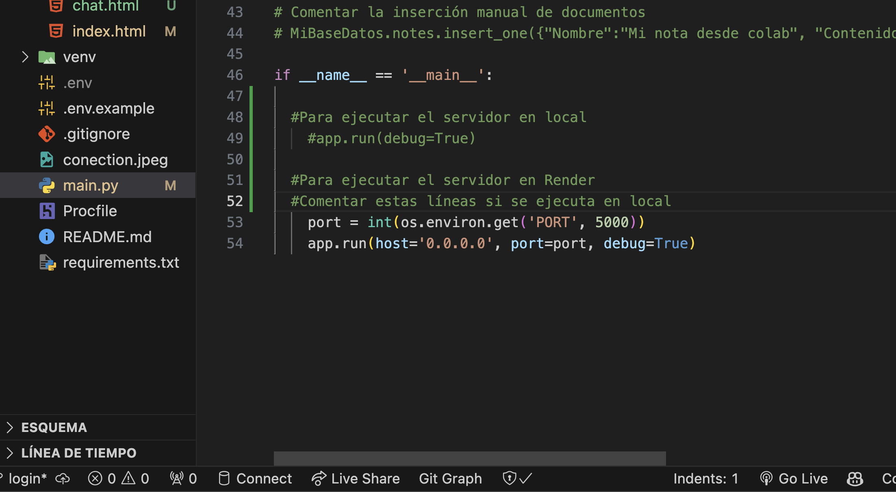

### Chatpy.io

Chatpy.io es un chat web que funcionara con socket.io, utilizando el paquete [socketio-client](https://github.com/socketio/socket.io).

### Prueba de conexión a MongoDB


### Iniciar el servidor

```bash
pip install flask dotenv pymongo
```

```bash
python main.py
```

### Pasos con maquina virtual en Windows

```bash
python -m venv venv
.\venv\Scripts\activate
```

```bash
pip install flask dotenv pymongo flask_socketio pytz
```

```bash
python main.py
```

### Pasos con maquina virtual en Linux

```bash
python3 -m venv venv
source venv/bin/activate
```

```bash
pip install flask dotenv pymongo flask_socketio pytz
```

### Instrucciones en local

