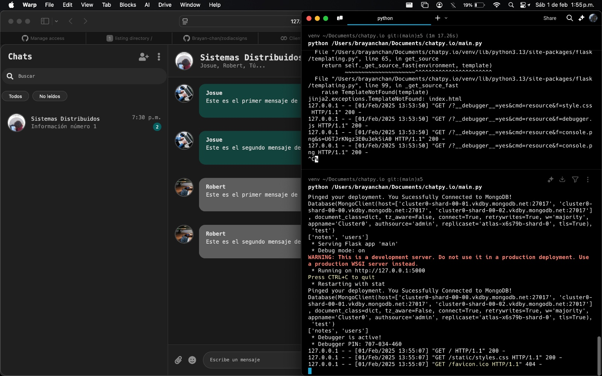

### Chatpy.io

Chatpy.io es un chat web que funcionara con socket.io, utilizando el paquete [socketio-client](https://github.com/socketio/socket.io).

### Prueba de conexión a MongoDB



## Reemplazar el .env.example por .env y reemplazar los valores con la URL de tu base de datos

## Crear entorno virtual para Windows

```bash
python -m venv venv
````

## Iniciarlizar el entorno virtual

```
.venv\Scripts\activate
```

## Crear entorno virtual para Linux y Mac

```bash
python3 -m venv venv
````

## Iniciarlizar el entorno virtual para Linux y Mac

```
source .venv/bin/activate
```

## Instalar las dependecias

- Primera forma

```bash
pip install flask dotenv pymongo flask-socketio pytz
```

- Segunda forma

```bash
pip install -r requirements.txt
```

## Ejecutar el proyecto en Windows

```bash
python main.py
```

## Ejecutar el proyecto en Linux y Mac

```bash
python3 main.py
```
